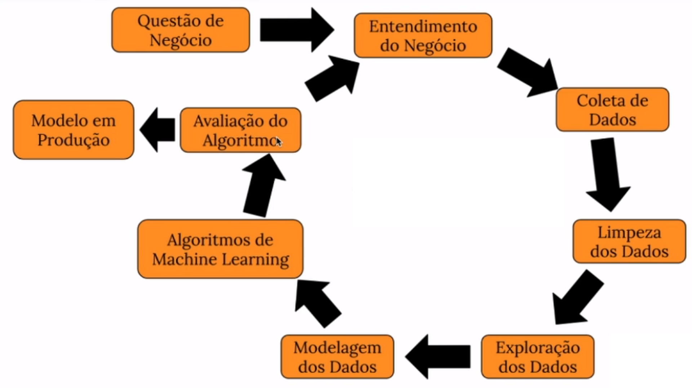

# Teste A/B - Conversão da Página

# Introdução

Esse é um projeto end-to-end de Data Sciente, focado na especiação com Teste A/B. No qual identificamos qual página nos trouxe a maior conversão em vendas, e mostramos a importância de aplicar esse tipo de teste e como isso pode ser mostrado em valor monetário.

O conjunto de dados pode ser encontrado através desse link: [Repositório do Kagle](https://www.kaggle.com/datasets/zhangluyuan/ab-testing?select=ab_data.csv)

Esse projeto faz parte da "Comunidade DS", que é um ambiente de estudo que promove o aprendizado, execução, e discussão de projetos de Data Science.

### Plano de Desenvolvimento do Projeto de Data Science

Esse projeto foi desenvolvido seguindo o método CRISP-DS(Cross-Industry Standard Process - Data Science). Essa é uma metodologia capaz de transformar os dados da empresa em conhecimento e informações que auxiliam na tomada de decisão. A metodologia CRISP-DM define o ciclo de vida do projeto, dividindo-as nas seguintes etapas:

- Entendimento do Problema de Negócio
- Coleção dos Dados
- Limpeza de Dados
- Análise Exploratória dos Dados
- Preparação dos Dados
- Modelos de Machine Learning.
- Avaliação dos Resultados do Modelo e Tradução para Negócio.
- Modelo em Produção

Observação: Como esse não é um projeto com uso de Machine Learning, os ciclos do CRISP-DM foram usados no contexto do Teste A/B.

### Planejamento

- [1. Descrição e Problema de Negócio](#1-descrição-e-problema-de-negócio)
- [2. Base de Dados e Premissas de Negócio](#2-base-de-dados-e-premissas-de-negócio)
- [3. Estratégia de Solução](#3-estratégia-de-solução)
- [4. Definição dos Parâmetros](#4-definição-dos-parâmetros)
- [5. Teste de Hipóteses](#5-teste-de-hipóteses)
- [6. Resultados de Negócio](#6-resultados-de-negócio)
- [7. Conclusão](#7-conclusão)
- [8. Aprendizados e Trabalhos Futuros](#8-aprendizados-e-trabalhos-futuros)

# 1. Descrição e Problema de Negócio

### 1.1 Descrição

A Electronic House é um comercio online ( e-commerce ) de produtos de informática para casas e escritórios. Os clientes podem comprar mouses, monitores, teclados, computadores, laptops, cabos HDMI, fones de ouvido, cameras webcam, entre outros, através de um site online e recebem os produtos no conforto de suas casas.

O time de UX designers vem trabalhando em uma nova página de vendas, com o objetivo de aumentar a taxa de conversão de um produto da loja, um teclado bluetooth. O product manager (gerente de produto) disse que a taxa de conversão da página atual é de 13% em média, no último ano.

O objetivo do product manager é aumentar a taxa de conversão em 2%, ou seja, a nova página de vendas, desenvolvida pelo time de UX, seria um sucesso se a sua taxa de conversão fosse de 15%.

O teclado bluetooth possui um preço de venda de R$ 4.500,00 à vista ou parcelado em 12% sem juros no cartão de crédito.

Antes de trocar a página de vendas antiga pela nova, o product manager gostaria de testar a efetividade da nova página em um grupo menor de clientes, a fim de correr menos riscos de queda da conversão, caso a página nova mostre uma conversão pior do que a página atual.

### 1.2 Problema de Negócio

O papel do Cientista de Dados foi para ajudar o time de Designers da nova página, a validar a sua efetividade de uma maneira mais segura, com mais confiança e rigidez na análise. E os entregáveis são:

**- A conversão da nova página é realmente melhor do a conversão da página atual?**

**- Qual o potencial de número de vendas que a nova página pode trazer?**

**- Qual o faturamento total na venda do teclado bluetooth através da nova página?**

# 2. Base de Dados e Premissas de Negócio

## 2.1 Base de Dados

O conjunto de dados total possui os seguintes atributos:
| **Atributos** | **Descrição** |
| ------------------- | ------------------- |
| user_id | Identificador do Usuário |
| timestamp | Data e Hora que o usuário acessou a página |
| group | Identificar o grupo - Controle ou tratamento |
| landing_page | Identificador da página - Nova ou antiga |
| converted | Flag de Conversão |

## 2.2 Premissas de Negócio

Para realizar esse projeto as seguintes premissas de negócio foram adotadas:

- É preciso garantir que o gruopo controle recebeu a página antiga e o grupo de tratamento recebeu a página nova.
- Há uma quantidade grande na população dos dados, para o teste iremos tirar uma amostra de acordo com os parâmetros definidos.
- As hipóteses serão: 
**H0 - A conversão da nova página é de 13% (Hipótese Nula)** 
**H1 - A conversão da nova página é diferente de 13%**

# 3. Estratégia de Solução

A estratégia de solução foi a seguinte:

### Passo 01. Análise descritiva dos dados

Nesse passo foi verificado alguns aspectos do conjunto de dados, como: nome de colunas, dimensões, tipos de dados, checagem e preenchimento de dados faltantes (NA), análise descritiva dos dados e quais suas variáveis categóricas.

Além disso, testes de duplicidade das amostras foram feitos, e os usuários que estavam em mais de um grupo foram retirados, devido a quantidade de dados que temos inicialmente.

### Passo 02. Design do Experimento

Nesse momento as hipóteses foram formadas, os parâmetros foram definidos em com isso o tamanho da amostra foi encontrado.

### Passo 03. Amostragem

Com o tamanho da amostra definido, foi possível selecionar as amostras de ambos os grupos de forma aleatória e preparar os dados para o teste.

### Passo 04. Taxa de Conversão

A taxa de conversão foi encontrada para os dados amostrados, onde essa taxa corresponde a taxa da população, seguindo o erro amostral definido nos parâmetros.

### Passo 05. Teste de Hipóteses

A metodologia do teste de hipóteses foi aplicado, seguindo a lógica ensinado e o resultado encontrado.

### Passo 06. Resultados de Negócio

Apenas o resultado do teste não é o suficiente, é preciso traduzir isso em linguagem de negócio, ou seja, como isso gerou valor para a empresa. Dessa forma, uma análise monetária foi feito com a hipótese de que a conversão subiu 2% e outra com a real aplicação encontrada.

# 4. Definição dos Parâmetros
A seguir daremos definições dos parâmetros e quais valores foram usados.

## 4.1 Nível de Confiança
É a probabilidade de que o intervalo de confiança contenha o verdadeiro parâmetro da população. Nesse teste um valor padrão de **95%** foi utilizado.

## 4.2 Nível de Significância
Pode ser definido como a probabilidade de rejeitar a hipótese nula quando ela é verdadeira, denotada por α (alfa), é o inverso do nível de confiência. Nesse projeto o valor foi de **5%**

## 4.3 Tamanho do Efeito
Seria a magnitude da diferença entre grupos ou a força de uma relação entre variáveis, indicando a importância prática dos resultados. O tamanho do efeito nos diz que quando o efeito é facilmente detectável, o tamanho da amostra é menor, enquanto, quando o efeito é mínimo, é preciso de uma amostra bem maior para prová-lo.

Nesse teste a biblioteca do python statsmodels foi utilizada para definir esse parâmetro, e para isso foi usado o efeito esperado. Assim, o efeito que queremos provar é que a **conversão inicial é de 13% e a conversão da nova página é de 15%**, assim será definido nosso Effect Size através da função proportion_effectsize.

## 4.4 Poder Estatístico
É probabilidade de detectar um efeito, se ele realmente existir, denotado por 1 - β (beta), onde β é a taxa de falso negativo. Nesse projeto o valor padrão de **80%** foi utilizado.

## 4.5 Tamanho da amostra
Com todos esse parâmetros encontramos o tamanho da amostra, que é a quantidade de observações ou indivíduos incluídos em um estudo ou experimento, essencial para garantir a validade e precisão dos resultados estatísticos.
O valor encontrado foi de **4.720** para cada grupo, e os valores que encontrarmos de conversão estarão representando toda a população, considerando um nível de confiância de 95%.

# 5. Teste de Hipóteses

Através da amostra encontrada, foi calculado as conversões da página, ou seja, todo mundo que entrou na página e comprou sobre todos que apenas entraram na página (valores da amostra), os resultados foram:

| **Grupo** | **Taxa de Conversão** |
| ------------------- | ------------------- |
| Controle (Página Antiga) | 11,55% |
| Tratamento (Página Nova) | 12,9 |

Esse resultado nos mostra uma melhor conversão na página nova, motivo pelo qual o teste foi criado, contudo, essa conversão é suficiente para provar que a página nova converte mais que a antiga?

Para isso faremos um teste de hipóteses, onde o intuito é rejeitar a hipótese nula, ou seja, que a conversão da página nova é diferente de 13% (seja ela maior ou menor).

# 6. Resultados de Negócio

Assim, podemos observar na imagem a seguir uma simulação do comportamento de cada um dis 7 produtos ao receberem um desconto de 5%.

Os produtos _12 MacBook (Mid 2017, Silver)_ e _Details About Apple Macbook Air 13.3 Laptop_ apresentam ganhos significavos, certamente impactados pelo alto valor de suas elasticidade de preço.

Os demais produtos também aumentam suas demandas e geram lucro apesar do desconto aplicado.

# 7. Elasticidade de Preços Cruzada

Contudo, como a mudança do preço desse produto implica na demanda dos demais produtos da mesma categoria? A fórmula a seguir visa explicar isso, realizando uma correlação entre a mudança de preço de um produto (B) e a mudança na demanda de outro produto (A).

Através desses valores podemos simular como seria o comportamento da cateoria inteira caso um desconto fosse aplicado em um produto e quais produtos seriam complementares ou substitutos ao mesmo.

Na imagem a seguir segue um exemplo disso, onde a aplicação criada realiza o cálculo automático de como o faturamento da categoria mudaria com a mudança no preço de um produto específico.

# 8. Modelo em Produção

Com essas consideração uma aplicação foi criada, com as seguintes funcionalidades:

- Calcular a elasticidade de produto escolhido;
- Mostrar se essa elasticidade tem significância estatística;
- Mostrar se a reta de regressão aplicada se ajusta bem aos dados;
- Apresentar o faturamento anual da categoria e como ele se altera com a mudança no preço de um produto;
- Apresentar os produtos que são correspondentes ou substitutos ao escolhido.

A aplicação foi implementada e colocado em produção por meio da cloud Streamlit (https://streamlit.io), que tem como objetivo possibilitar a criação, execução e operação de aplicativos inteiramente localizados em nuvem.

 

Para utilizar basta entrar no [link](https://elasticidade-de-preco.streamlit.app) e escolher o produto.

O resultado do faturamento após o desconto é mostrado ao clicar no checkbox e variar o número da variação percentual a ser aplicada no produto.

# 9. Conclusão

Nesse projeto, foram realizadas todas as etapas necessárias para a implementação de um projeto completo de Data Science em um ambiente de produção. Foi utilizado o método de gerenciamento de projeto chamado CRISP-DM/DS e obteve-se um desempenho satisfatório em compreender a utilização da elasticidade de preço e criar um entregável que disponibilize essas informações de maneira rápida e fácil.

Tendo em vista esses resultados, o projeto alcançou seu objetivo de encontrar uma solução simples e assertiva para apresentar os resultados da elasticidade de preço, disponibilizando um web app no Streamlit que retorna a elasticidade do produto, como a variação no seu preço impacta no faturamento anual da categoria e quais são os produtos substitutos e correspondentes de forma rápida e eficaz.

# 10. Aprendizados e Trabalhos Futuros

**Aprendizados**

- Compreensão e aplicação da elasticidade de preço e elasticidade de preços cruzada.
- Conceitos de criação de uma aplicação no Streamlit que resolva o problema de negócio.

**Trabalhos Futuros**

- Realizar uma EDA mais aprodunda na categoria de Laptops e Computadores da Best Buy.
- Através dessa EDA visar explicar quais são os melhores produtos e procurar indícios que expliquem sua elasticidade de preços.
- Utilizar outras formas de calcular a elasticidade de preços.
- Otimizar o web app de forma de fique mais funcional para seus usuários.
